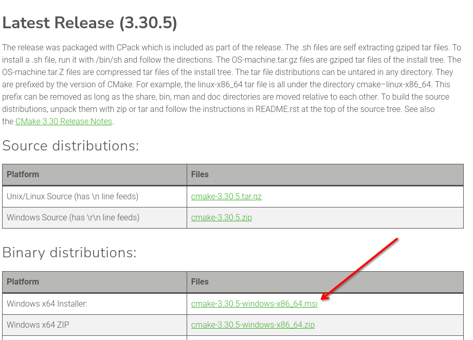

# Qt6 Project for ACPI
This project uses CMake. 

## Windows
For Windows, download it [here](https://cmake.org/download/).  



## Linux
For Linux `cmake` is usually available as a package. 
I use Debian, and it has `sudo apt update && sudo apt install cmake`. 

## MacOS
I do not have MacOS, so please find a tutorial.

# Building
Open a terminal in this folder and run:
```
mkdir build
cd build
cmake ..
cmake --build .
```

You should now be able to use Visual Studio on Windows to open the project (find the `.sln` file inside `build/`).

For Linux and MacOS, use whatever IDE you want.
